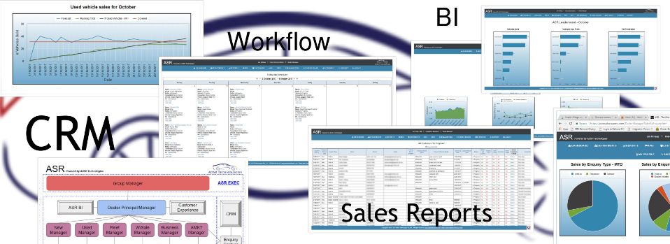
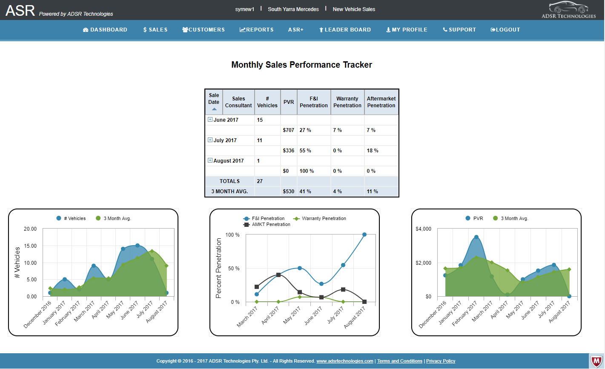
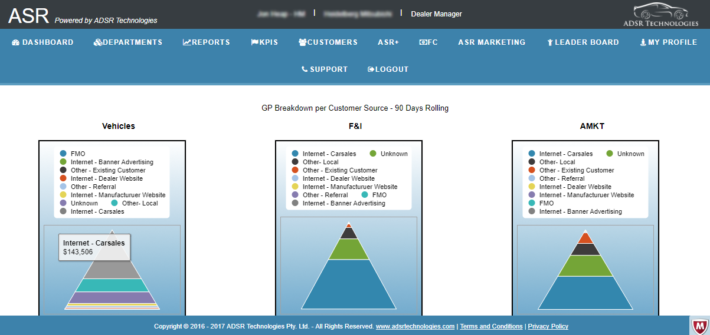
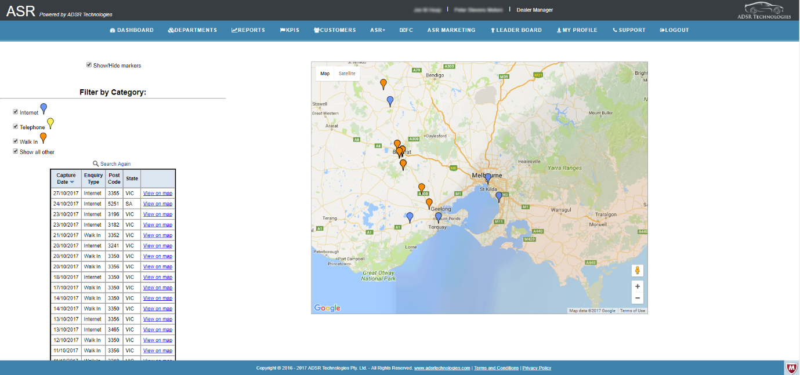
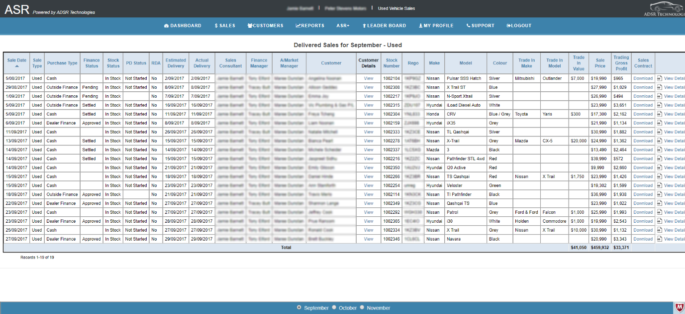
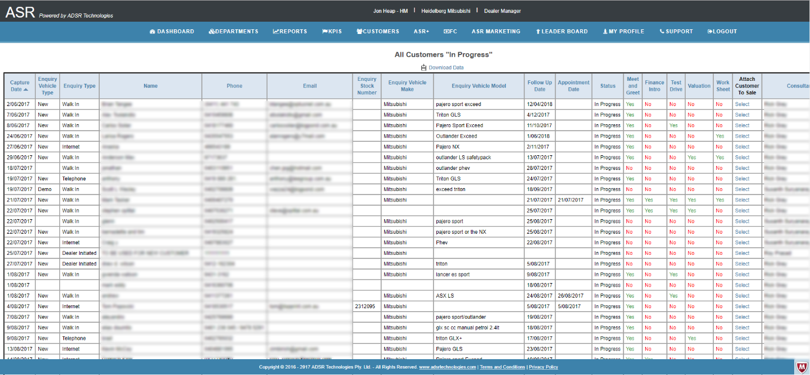

AustoSalesReport
================

ADSR Technologies was founded by [Hendrik
Dreyer](https://www.linkedin.com/in/hendrik-dreyer-84532322/) and [Jon
Heap](https://www.linkedin.com/in/jon-heap-a61500a6/). The company’s existence
was brought about by the creation of its main product, AustoSalesReports (ASR).



The idea behind ASR was to create an amalgamated CRM/Sales Reporting system with
powerful business intelligence capabilities. ASR focusses solemnly on the
Australian automotive industry. ASR has the capability to establish, manage,
monitor and measure sales lines across the entire dealership (new, used, fleet,
wholesale, finance, insurance and aftermarket). ASR enables managers to closely
monitor the performance of their sales teams. Sales consultants can easily build
and maintain their individual sales pipelines and comfortably track potential
customers through various “Road-to-a-sale” built-in steps in ASR. ASR enables
dealer principles to have a birds’ eye view of the entire dealership.

ASR also enables each dealership to set individual KPIs for each department,
sales manager and sales consultant. This way, at any given time, ASR can swiftly report
and visually portray the current position of the dealerships’ sales targets and
how it is tracking. Ultimately, ASR was built to help dealerships become more profitable, and it does so by 
assisting them to maximize sales and optimising internal processes such as marketing, service delivery and sales performance.  

Figure - ASR Concept



ASR was designed and developed in the Caspio integrated development environment,
which is fully functional in the cloud and runs on AWS. Therefore, ASR scales
seamlessly and is deployable at any site that houses an internet connection.

Figure - ASR Database Design (MS-SQL-Server)



The functionality behind ASR caters for easy deployment and setup. No
installations has to be performed in order to get ASR operational. Once a client
has signed up for ASR, a dealership account was created and the dealership would be
immediately able to go live.



ASR facilitates multiple views into the operations of a dealership. Different
user levels present different views of operational dealership data. This enable
different users to concentrate on only the data that is relevant to their jobs.
ASR showcases a pinpoint directed CRM system and capturing customer data is
intuitive and easy.



Various ASR built-in schedulers assists key personnel in the dealership to
effectively coordinate and facilitate such activities as lead follow ups, sales
appointments, vehicle deliveries and after sales follow-ups.

Figure - ASR Follow-up Scheduler



A dealership’s marketing department can gain powerful insights into customers by
viewing customer numbers across various sources and departments. This enables
dealerships to more effectively plan on which marketing sources they should
spend their marketing dollars.

Figure - ASR Customer Source Breakdown



ASR also facilitated healthy competition amongst sales consultants by giving
access to company wide leader boards. Leader boards report on sales numbers
across all departments.

Figure - ASR Leader board



Interactive menus in ASR makes it easy to navigate your way around the ASR desktop.

Figure - Interactive Menus



Geo-mapping reports on where the dealership’s customer base is originating from.
This information assists the marketing department to decide in which regions
they should spend their marketing dollars.

Figure - Customer geo-location



Vehicle enquiries by customers are very important to dealerships. ASR assists
dealerships in tracking vehicle enquiries, which they in turn must report back
to the manufacturers. Manufacturers rely heavily on these enquiry numbers to
effectively plan their production output.

Figure - ASR Vehicle Enquiries



Sales consultants can easily view monthly sales details by ways of ASR sales
logs. All sales logs are updated in real-time and thus keeps everyone in the
dealerships up to date regarding sale changes in real-time.

Figure - ASR Sales Logs



Sales pipelines assists sales consultant on focussing their efforts on the right
customers to ensure maximum probability of closing a sale.

Figure - Customers Sales Pipeline



All data that flows through ASR and are in rest in the ASR database are
encrypted. ASR’s unique architecture allows it to scale seamlessly and
effectively. User administration is hassle-free and user accounts can be
activated and de-activated with ease.

ASR also supports email notifications. In the event of a change on a critical
field in a sales record, sales consultants can automatically notify their
managers (and vice-a-versa). This information flow facilitates awareness on
information changes, which drives customer service and sales
efficiency.



